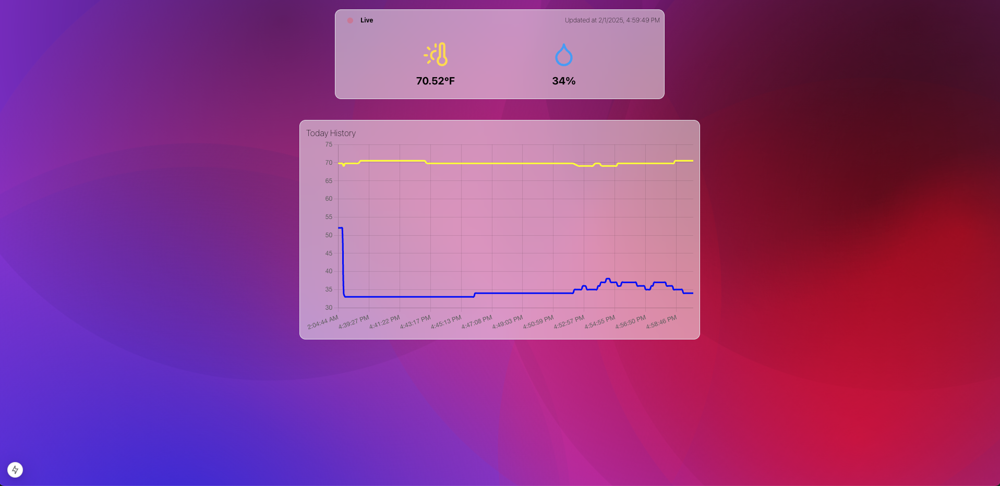

## Introduction

This project is a home sensors server built with Next.js. It allows you to collect, monitor, and manage various sensors in your home

## Getting Started

First, run the development server:

```bash
npm run dev
# or
yarn dev
# or
pnpm dev
# or
bun dev
```

Open [http://localhost:3000](http://localhost:3000) with your browser to see the result.
